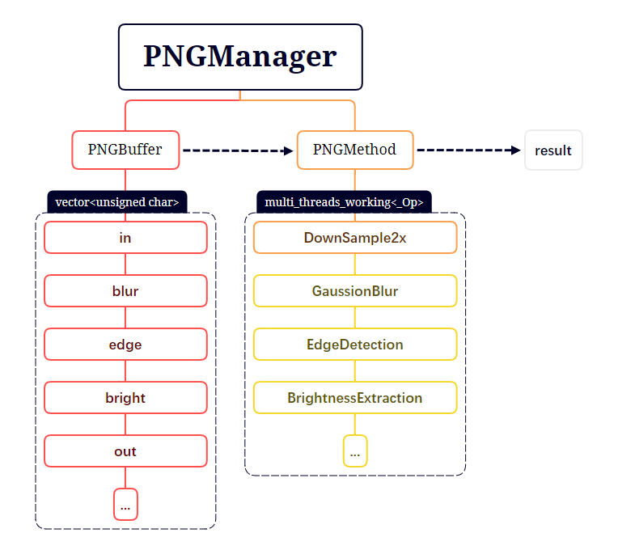

# PNGProcessing

## 项目介绍

使用C++11及以上的特性，多线程执行高斯模糊、边缘检测和亮度提取的PNG图像处理程序。

## 程序架构

## 使用方法

启动exe或编译运行，进入命令行界面，支持如下指令

- `blur [from_path] [to_path]`  高斯模糊（输出半分辨率）
- `edge [from_path] [to_path]`  边缘检测
- `bright [from_path] [to_path]`  亮度提取
- `all [from_path] [to_path]`  以上全部执行

其中 `[from_path] [to_path]` 可以省略，默认的路径分别为 `"../source/"` 和 `"../result/"` 。

对于 `bright` 以及 `all`，需要额外提供一个亮度阈值参数（0-255）。

## 文件结构

- `main.cpp` : 接收用户输入，调用 `PNGManager` 接口
- `PNGManager.h` : 储存路径，创建 `PNGBuffer` ，分配多线程执行 `PNGMethod` 
- `PNGBuffer.h` : 依赖 `loadpng` 库编解码图片，储存图片缓冲数据
- `PNGMethod.h` : 定义图片处理方法

## 优化思路

- 高斯模糊
  - [先降采样，再分离核函数](https://www.intel.com/content/www/us/en/developer/articles/technical/an-investigation-of-fast-real-time-gpu-based-image-blur-algorithms.html)
- 边缘检测
  - 在高斯模糊基础上，转灰度图
  - 然后只计算R通道，[对 sobel kernel 分离核函数](https://en.wikipedia.org/wiki/Sobel_operator)
  - 第一遍一次采样，输出 Gx_Horizontal 和 Gy_Horizontal，然后分别对这两个 buffer 计算最终 Gx 和 Gy，最后合并
  - 上采样并输出
- 亮度提取
  - 在降采样灰度图上计算

## 已知问题

- 暂时只支持RGBA8格式PNG。